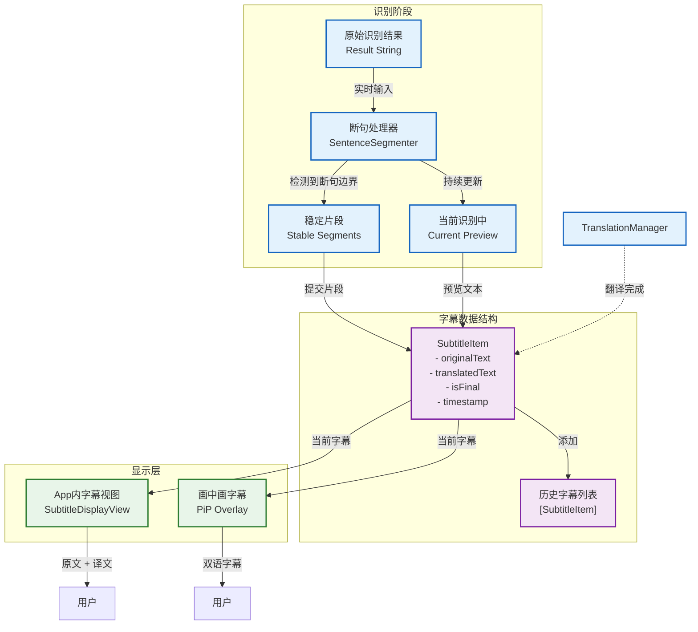

# 字幕显示更新图

## 字幕更新机制

### 1. 实时识别阶段
- 语音识别持续输出原始文本
- `SpeechSentenceSegmenter` 实时分析文本，检测稳定断句边界
- 未断句的部分作为"当前预览"显示

### 2. 字幕项状态
- **isFinal = false**: 正在识别中，文字可能还会变化（显示橙色）
- **isFinal = true**: 已完成识别，文字稳定（显示黑色）
- **translatedText**: 初始为"翻译中..."，翻译完成后更新

### 3. 显示分区
- **上半部分 (原文)**: 显示 SpeechRecognitionManager 识别的原始文本
- **下半部分 (译文)**: 显示 TranslationManager 翻译后的文本
- **历史记录**: 已完成的字幕项添加到历史列表

### 4. 画中画显示
- 当前会话的所有已翻译文本合并显示在译文区域
- 原文区域显示当前正在识别的内容
