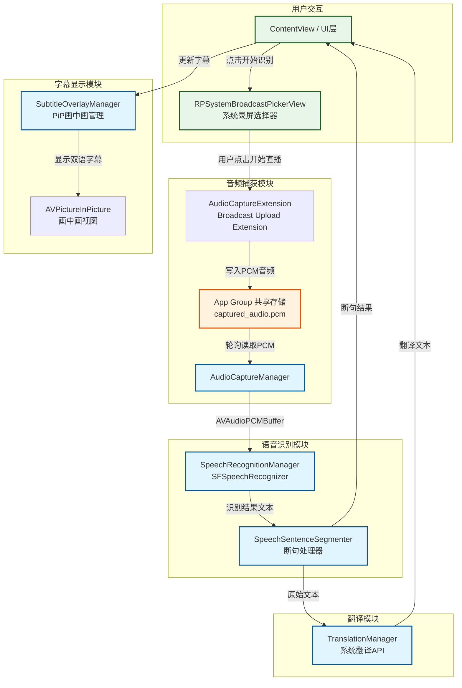

# 系统数据流图

## 数据流说明

1. **用户触发**: 用户点击"开始识别"按钮，弹出系统 RPSystemBroadcastPickerView
2. **音频捕获**: 用户在系统界面点击"开始直播"，Extension 开始捕获系统音频，写入共享 PCM 文件
3. **音频读取**: 主 App 通过 AudioCaptureManager 轮询读取共享文件，转换为 AVAudioPCMBuffer
4. **语音识别**: SpeechRecognitionManager 接收音频缓冲区，进行实时语音识别
5. **断句处理**: SpeechSentenceSegmenter 对识别结果进行断句处理
6. **翻译**: 断句后的文本进入翻译队列，由 TranslationManager 调用系统翻译 API
7. **显示**: 最终的原文和译文通过 SubtitleOverlayManager 在画中画中显示
