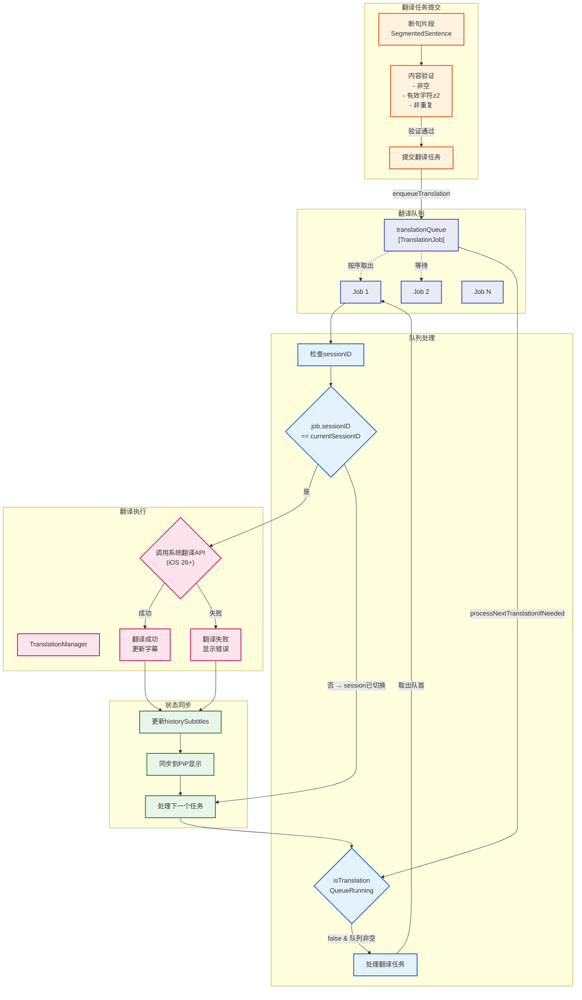

# 翻译队列图

## 翻译队列处理机制

### 1. 任务入队
- 断句完成后，通过 `enqueueTranslation()` 添加到队列
- 每个任务包含：`subtitleID`, `text`, `sessionID`

### 2. 队列处理逻辑
- 使用 `isTranslationQueueRunning` 标志防止并发
- 每次只处理一个翻译任务
- 任务完成后自动处理下一个

### 3. Session 隔离
- 每次新识别会话生成新的 `translationSessionID`
- 新会话开始时清空队列并取消正在进行的翻译
- 处理时检查 `job.sessionID == translationSessionID`，不匹配则跳过

### 4. 错误处理
- 翻译成功: 更新 `historySubtitles` 中对应字幕的翻译文本
- 翻译失败: 显示"翻译失败"占位符
- 无论成功失败，都会继续处理队列中的下一个任务

### 5. 显示同步
- 翻译完成后:
  1. 更新 `historySubtitles` 数组中的字幕项
  2. 调用 `syncPiPTranslatedTextFromCurrentSession()` 同步到画中画显示
  3. 将当前会话所有已翻译文本合并显示在译文区域
